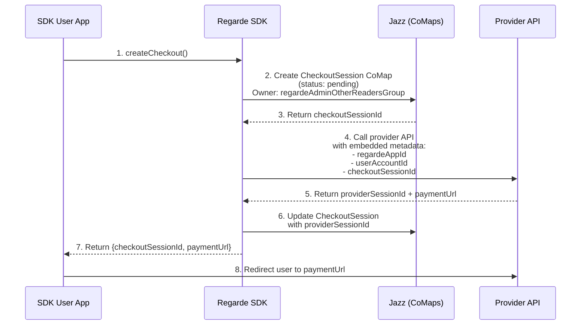
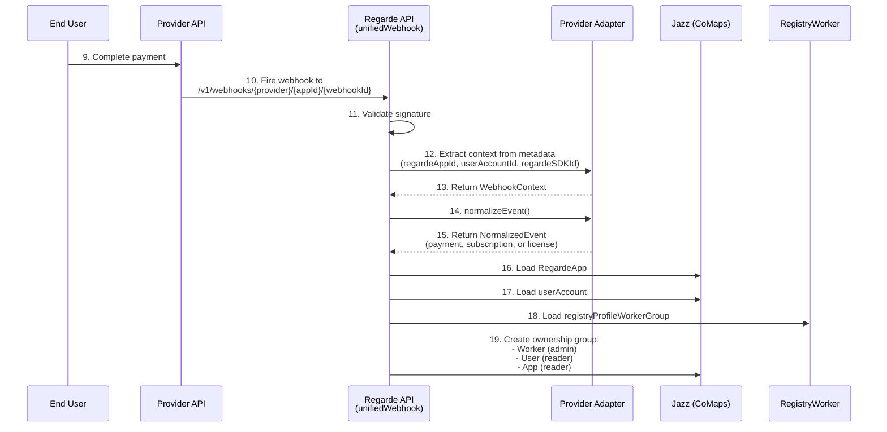
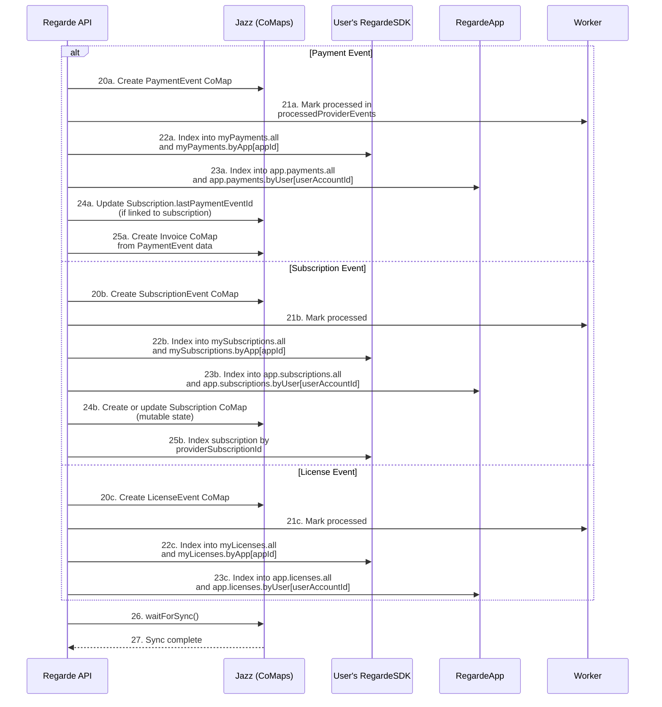
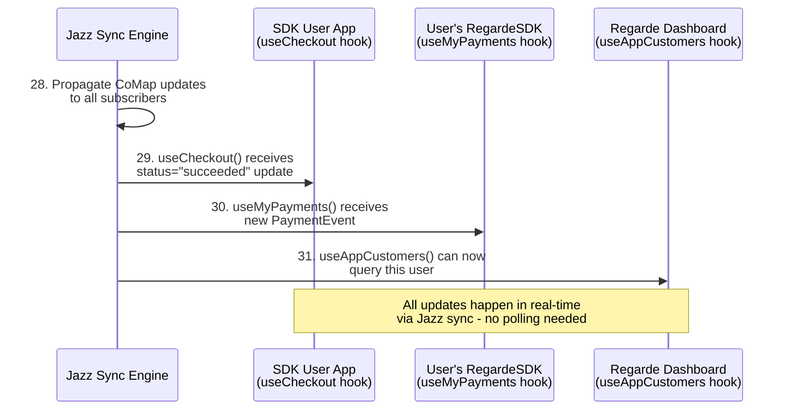

# Regarde Payment Orchestration Upgrade Plan

## Overview

Transform Regarde from a webhook receiver into a full payment orchestration library with SDK wrapping provider SDKs (Stripe, Polar, LemonSqueezy).

**Target**: Regarde becomes the "Native Jazz payment processing library" - payments sync across devices, work offline, and users own their data.

**Value Proposition**:
> "Add payments to your Jazz app in 10 minutes. Your users' payment history syncs across devices, works offline, and they own their data. Support Stripe, Polar, and LemonSqueezy with one API."

## Architecture Principles

1. **Regarde does NOT store provider API keys** - API keys provided by SDK-user (not stored by Regarde)
2. **Checkout helpers embed Regarde metadata** - ensures webhooks route correctly
3. **Webhook normalization is the core value** - tedious, error-prone, Regarde does it well
4. **Jazz sync replaces polling** - instant updates across devices
5. **Worker creates payment data and end-user reads via CoMaps in their account**
6. **Unified error handling** - Normalize provider errors into Regarde-specific error types

## Data Ownership Model

```
┌─────────────────────────────────────────────────────────────┐
│  regardeAdminOtherReadersGroup (Owner: User Account)        │
│  ├─ Members:                                                 │
│  │  • regardeProfileWorkerGroup (Admin) - Can write         │
│  │  • User Account (Reader) - Can read                      │
│  └─ CoMaps owned by this group:                              │
│     • PaymentEvent (created by worker)                      │
│     • SubscriptionEvent (created by worker)                 │
│     • Subscription (created by worker, updated by events)   │
│     • LicenseEvent (created by worker)                      │
│     • CheckoutSession (created by SDK, updated by worker)   │
│     • Invoice (created by worker from payment data)         │
└─────────────────────────────────────────────────────────────┘
```

## Schema Naming Convention

All schemas use explicit naming for clarity:
- `appId` (not `app`)
- `userAccountId` (not `userAccount`)
- `webhookId` (already correct)
- `subscriptionId` (reference to Subscription CoMap)
- `paymentEventId` (reference to PaymentEvent CoMap)

## New CoMap Types

### CheckoutSession

Tracks the full lifecycle of a payment checkout from creation to completion.

```typescript
export const CheckoutSession = co.map({
  // Routing for webhooks
  appId: z.string(), // RegardeApp ID
  userAccountId: z.string(), // JazzAccountId of the payer

  // Provider info
  provider: z.enum(["stripe", "polar", "lemonsqueezy"]),
  providerSessionId: z.string().optional(), // Provider's checkout session ID

  // Status (updated by worker via webhooks)
  status: z.enum(["pending", "processing", "succeeded", "failed", "canceled", "expired"]),
  mode: z.enum(["payment", "subscription"]),

  // Payment details
  amount: z.number(),
  currency: z.string(),
  customerEmail: z.string().optional(),

  // Results (filled by worker)
  paymentEventId: z.string().optional(), // Links to PaymentEvent
  subscriptionId: z.string().optional(), // Links to Subscription (if mode=subscription)

  // Timestamps
  createdAt: z.number(),
  expiresAt: z.number().optional(),
  completedAt: z.number().optional(),
});
```

**Storage Location**: `RegardeApp.checkoutSessions` (per-user indexed)

### Invoice

User-owned receipt that works offline, generated from PaymentEvent data.

```typescript
export const Invoice = co.map({
  // Links
  appId: z.string(),
  userAccountId: z.string(),
  paymentEventId: z.string(),

  // Content (user-owned, works offline)
  invoiceNumber: z.string(),
  date: z.number(),
  amount: z.number(),
  currency: z.string(),
  description: z.string(),

  // Line items
  items: co.list(
    co.map({
      description: z.string(),
      quantity: z.number(),
      unitPrice: z.number(),
      total: z.number(),
    }),
  ),

  // Totals
  subtotal: z.number(),
  tax: z.number().optional(),
  total: z.number(),

  // Provider reference (for reconciliation)
  providerInvoiceId: z.string().optional(), // Stripe invoice ID if available

  createdAt: z.number(),
});
```

**Storage Location**: Created by worker, owned by user's admin group

### Subscription (Already Exists)

Tracks subscription lifecycle with Jazz-native real-time updates. Already implemented in `subscriptionEvent.ts`.

**Storage Location**: Created/updated by worker, indexed in user's RegardeSDK

### Extended RegardeApp Schema

```typescript
export const RegardeApp = co.map({
  // ... existing fields ...

  // Checkout sessions for this app
  checkoutSessions: co.map({
    all: co.record(z.string(), z.string()), // sessionId -> CheckoutSession.id
    byUser: co.record(z.string(), co.record(z.string(), z.string())),
  }),

  // Subscriptions for this app (already exists)
  subscriptions: co.map({
    all: co.record(z.string(), z.string()), // subscriptionId -> Subscription.id
    byUser: co.record(z.string(), co.record(z.string(), z.string())),
    status: co.record(z.string(), z.string()),
  }),
});
```

## Complete Orchestration Flow

### Phase 1: Checkout Initiation



### Phase 2: Webhook Processing & Event Normalization



### Phase 3: Event Creation & Indexing



### Phase 4: Real-Time Sync to Subscribers



## SDK Architecture

### Three Layers

```
┌─────────────────────────────────────────────────────────┐
│ Layer 3: React Hooks (@regarde-dev/core/react)          │
│  • useCreateCheckout()                                  │
│  • useCheckout()                                        │
│  • useCreateSubscription()                              │
│  • useSubscription()                                    │
│  • usePauseSubscription()                               │
│  • useResumeSubscription()                              │
│  • useCancelSubscription()                              │
│  • useAppCustomers()                                    │
└─────────────────────────────────────────────────────────┘
                           │
                           ▼
┌─────────────────────────────────────────────────────────┐
│ Layer 2: Unified Managers (@regarde-dev/core)           │
│  • checkoutManager.create()                             │
│  • subscriptionManager.create()                         │
│  • subscriptionManager.pause()                          │
│  • subscriptionManager.resume()                         │
│  • subscriptionManager.cancel()                         │
└─────────────────────────────────────────────────────────┘
                           │
                           ▼
┌─────────────────────────────────────────────────────────┐
│ Layer 1: Provider Wrappers (@regarde-dev/core)          │
│  • providers/stripe/checkout.ts                         │
│  • providers/stripe/subscription.ts                     │
│  • providers/polar/checkout.ts                          │
│  • providers/polar/subscription.ts                      │
│  • providers/lemonsqueezy/checkout.ts                   │
│  • providers/lemonsqueezy/subscription.ts               │
└─────────────────────────────────────────────────────────┘
```

### Unified API Design

#### Checkout Creation

```typescript
export interface CreateCheckoutParams {
  provider: TPaymentProvider;
  amount: number;
  currency: string;
  mode: "payment" | "subscription";
  appId: string;
  successUrl: string;
  cancelUrl: string;
  customerEmail?: string;
  metadata?: Record<string, string>;

  // Provider-specific escape hatches
  stripe?: StripeCheckoutOptions;
  polar?: PolarCheckoutOptions;
  lemonsqueezy?: LemonSqueezyCheckoutOptions;
}

export interface CreateCheckoutResult {
  checkoutSessionId: string; // Jazz CoMap ID
  paymentUrl: string;
  status: "pending";
}

// Usage
const result = await checkoutManager.create(account, {
  provider: "stripe",
  amount: 1000,
  currency: "usd",
  mode: "payment",
  appId: "co_app123",
  successUrl: "https://myapp.com/success",
  cancelUrl: "https://myapp.com/cancel",
  stripe: {
    allow_promotion_codes: true,
    tax_id_collection: { enabled: true },
  },
});
```

#### Subscription Management

```typescript
export interface SubscriptionManager {
  async create(
    account: TRegardeAccount,
    params: CreateSubscriptionParams
  ): Promise<CreateSubscriptionResult>;

  async pause(
    account: TRegardeAccount,
    subscriptionId: string
  ): Promise<void>;

  async resume(
    account: TRegardeAccount,
    subscriptionId: string
  ): Promise<void>;

  async cancel(
    account: TRegardeAccount,
    subscriptionId: string
  ): Promise<void>;
}
```

### Error Handling

```typescript
export class RegardeError extends Error {
  constructor(
    message: string,
    public code: string,
    public provider?: string,
    public originalError?: unknown
  ) {
    super(message);
    this.name = "RegardeError";
  }
}

export const ErrorCodes = {
  // Checkout errors
  CHECKOUT_CREATE_FAILED: "checkout_create_failed",
  CHECKOUT_EXPIRED: "checkout_expired",
  CHECKOUT_CANCELED: "checkout_canceled",

  // Subscription errors
  SUBSCRIPTION_CREATE_FAILED: "subscription_create_failed",
  SUBSCRIPTION_PAUSE_FAILED: "subscription_pause_failed",
  SUBSCRIPTION_RESUME_FAILED: "subscription_resume_failed",
  SUBSCRIPTION_CANCEL_FAILED: "subscription_cancel_failed",

  // Provider errors
  PROVIDER_API_ERROR: "provider_api_error",
  PROVIDER_AUTHENTICATION_FAILED: "provider_auth_failed",
  PROVIDER_RATE_LIMITED: "provider_rate_limited",

  // Validation errors
  INVALID_AMOUNT: "invalid_amount",
  INVALID_CURRENCY: "invalid_currency",
  MISSING_REQUIRED_FIELD: "missing_required_field",

  // Jazz/State errors
  COMAP_NOT_FOUND: "comap_not_found",
  SYNC_FAILED: "sync_failed",
} as const;
```

## React Hooks API

### useCreateCheckout

```typescript
export interface UseCreateCheckoutResult {
  createCheckout: (params: CreateCheckoutParams) => Promise<CreateCheckoutResult>;
  isCheckoutCreating: boolean;
  checkoutError: RegardeError | null;
}

export function useCreateCheckout(): UseCreateCheckoutResult;

// Usage
function CheckoutButton() {
  const { createCheckout, isCheckoutCreating, checkoutError } = useCreateCheckout();

  const handleClick = async () => {
    const result = await createCheckout({
      provider: "stripe",
      amount: 1000,
      currency: "usd",
      mode: "payment",
      appId: "co_app123",
      successUrl: "https://myapp.com/success",
      cancelUrl: "https://myapp.com/cancel",
    });

    // Redirect to payment
    window.location.href = result.paymentUrl;
  };

  // Golden Rule: Explicit boolean checks
  if (isCheckoutCreating === true) {
    return <Spinner />;
  }

  return <button onClick={handleClick}>Pay Now</button>;
}
```

### useCheckout

```typescript
export interface UseCheckoutOptions {
  checkoutSessionId: string;
}

export interface UseCheckoutResult {
  checkout: TCheckoutSession | null;
  isCheckoutLoading: boolean;
  checkoutError: Error | null;
}

export function useCheckout(options: UseCheckoutOptions): UseCheckoutResult;

// Usage - Subscribe to real-time updates
function CheckoutStatus({ checkoutSessionId }: { checkoutSessionId: string }) {
  const { checkout, isCheckoutLoading } = useCheckout({ checkoutSessionId });

  if (isCheckoutLoading === true) {
    return <div>Loading...</div>;
  }

  if (checkout === null) {
    return <div>Checkout not found</div>;
  }

  // Status updates in real-time via Jazz sync
  return (
    <div>
      Status: {checkout.status}
      {checkout.status === "succeeded" && <SuccessMessage />}
      {checkout.status === "failed" && <FailureMessage />}
    </div>
  );
}
```

### useAppCustomers

```typescript
export interface UseAppCustomersOptions {
  appId: string;
}

export interface UseAppCustomersResult {
  customers: TAppCustomer[];
  isLoading: boolean;
  error: Error | null;
}

export interface TAppCustomer {
  userAccountId: string;
  email?: string;
  totalPayments: number;
  totalSpent: number;
  firstPaymentAt: number;
  lastPaymentAt: number;
}

export function useAppCustomers(options: UseAppCustomersOptions): UseAppCustomersResult;

// Usage - Query paying customers for dashboard
function CustomersDashboard({ appId }: { appId: string }) {
  const { customers, isLoading } = useAppCustomers({ appId });

  if (isLoading === true) {
    return <div>Loading customers...</div>;
  }

  return (
    <table>
      <thead>
        <tr>
          <th>Customer</th>
          <th>Total Spent</th>
          <th>Payments</th>
          <th>Last Payment</th>
        </tr>
      </thead>
      <tbody>
        {customers.map((customer) => (
          <tr key={customer.userAccountId}>
            <td>{customer.email || customer.userAccountId}</td>
            <td>${customer.totalSpent.toFixed(2)}</td>
            <td>{customer.totalPayments}</td>
            <td>{new Date(customer.lastPaymentAt).toLocaleDateString()}</td>
          </tr>
        ))}
      </tbody>
    </table>
  );
}
```

### usePauseSubscription, useResumeSubscription, useCancelSubscription

```typescript
export interface UsePauseSubscriptionResult {
  pauseSubscription: (subscriptionId: string) => Promise<void>;
  isSubscriptionPausing: boolean;
  pauseError: RegardeError | null;
}

export function usePauseSubscription(): UsePauseSubscriptionResult;

// Similar patterns for useResumeSubscription and useCancelSubscription
```

## Provider Implementation Pattern

### Stripe Checkout Wrapper

```typescript
// packages/sdk/src/core/providers/stripe/checkout.ts
import Stripe from "stripe";

export const createStripeCheckout = async (
  apiKey: string, // Passed by developer, NOT stored by Regarde
  params: CreateCheckoutParams
): Promise<{ providerSessionId: string; paymentUrl: string }> => {
  const stripe = new Stripe(apiKey, { apiVersion: "2024-12-18.acacia" });

  const session = await stripe.checkout.sessions.create({
    line_items: [
      {
        price_data: {
          currency: params.currency.toLowerCase(),
          product_data: { name: "Purchase" },
          unit_amount: params.amount,
        },
        quantity: 1,
      },
    ],
    mode: params.mode,
    success_url: params.successUrl,
    cancel_url: params.cancelUrl,
    customer_email: params.customerEmail,
    // Provider-specific escape hatches
    ...params.stripe,
    metadata: {
      // Embed Regarde metadata for webhook routing
      regarde_session_id: params.checkoutSessionId,
      regarde_app_id: params.appId,
      regarde_user_id: params.userAccountId,
      regarde_sdk_id: params.regardeSDKId,
      ...params.metadata,
    },
  });

  return {
    providerSessionId: session.id,
    paymentUrl: session.url!,
  };
};
```

## API Changes: Enhanced Webhook Processing

The existing webhook handlers update CheckoutSession CoMaps and create Invoice CoMaps:

```typescript
// In webhook handler (packages/api.regarde.dev/src/domains/payments/handlers/unifiedWebhook.ts)

// After creating PaymentEvent
if (normalized.eventType === "payment.checkout_completed") {
  // Update CheckoutSession
  const checkoutSessionId = metadata.regarde_session_id;
  if (checkoutSessionId !== undefined) {
    const checkoutSession = await CheckoutSession.load(checkoutSessionId, {
      loadAs: worker,
    });

    if (checkoutSession !== null && checkoutSession.$isLoaded === true) {
      checkoutSession.status = "succeeded";
      checkoutSession.completedAt = normalized.timestamp;
      checkoutSession.paymentEventId = event.$jazz.id;
      await checkoutSession.$jazz.waitForSync();
    }
  }

  // Create Invoice from PaymentEvent
  const invoice = Invoice.create(
    {
      appId: appId,
      userAccountId: jazzAccountId,
      paymentEventId: event.$jazz.id,
      invoiceNumber: `INV-${Date.now()}`,
      date: normalized.timestamp,
      amount: data.amount,
      currency: data.currency,
      description: `Payment via ${normalized.provider}`,
      items: [
        {
          description: "Payment",
          quantity: 1,
          unitPrice: data.amount,
          total: data.amount,
        },
      ],
      subtotal: data.amount,
      total: data.amount,
      providerInvoiceId: providerMetadata.invoiceId,
      createdAt: Date.now(),
    },
    { owner: eventOwnerGroup }
  );

  await invoice.$jazz.waitForSync();
}
```

## Implementation Phases

### Phase 1

**Goal**: Core checkout + subscription lifecycle + invoice generation

**New Schemas:**
- `packages/sdk/src/core/schemas/checkoutSession.ts` - CheckoutSession CoMap
- `packages/sdk/src/core/schemas/invoice.ts` - Invoice CoMap

**Modified Schemas:**
- `packages/sdk/src/core/schemas/regardeUserApp.ts` - Add checkoutSessions field

**Provider Wrappers:**
- `packages/sdk/src/core/providers/stripe/checkout.ts` - Stripe checkout creation
- `packages/sdk/src/core/providers/stripe/subscription.ts` - Stripe subscription actions
- `packages/sdk/src/core/providers/polar/checkout.ts` - Polar checkout creation
- `packages/sdk/src/core/providers/polar/subscription.ts` - Polar subscription actions
- `packages/sdk/src/core/providers/lemonsqueezy/checkout.ts` - Upgrade from URL generator

**Managers:**
- `packages/sdk/src/core/checkout/checkoutManager.ts` - Unified checkout API
- `packages/sdk/src/core/subscription/subscriptionManager.ts` - Unified subscription API

**React Hooks:**
- `packages/sdk/src/frameworks/react/useCreateCheckout.ts`
- `packages/sdk/src/frameworks/react/useCheckout.ts`
- `packages/sdk/src/frameworks/react/useCreateSubscription.ts`
- `packages/sdk/src/frameworks/react/useSubscription.ts`
- `packages/sdk/src/frameworks/react/usePauseSubscription.ts`
- `packages/sdk/src/frameworks/react/useResumeSubscription.ts`
- `packages/sdk/src/frameworks/react/useCancelSubscription.ts`
- `packages/sdk/src/frameworks/react/useAppCustomers.ts`

**Webhook Updates:**
- `packages/api.regarde.dev/src/domains/payments/handlers/unifiedWebhook.ts` - Update CheckoutSession, create Invoice

**Error Handling:**
- `packages/sdk/src/core/errors.ts` - RegardeError class + ErrorCodes

**Tests:**
- Checkout creation flow
- Subscription lifecycle (create, pause, resume, cancel)
- Error normalization
- React hooks
- Invoice generation

### Phase 2

**Goal**: Enhanced customer insights + advanced subscription features

- Subscription upgrades/downgrades
- Usage-based billing helpers
- Customer portal features (if needed)
- Advanced analytics hooks

### Phase 3

**Goal**: Developer experience improvements

- shadcn CLI registry integration
- Pre-built checkout UI components
- Documentation and examples
- Migration guide from current webhook-only usage

## Key Decisions Summary

| Decision | Choice | Rationale |
|----------|--------|-----------|
| **CheckoutSession storage** | `RegardeApp.checkoutSessions` | Per-user indexed, consistent with payments structure |
| **Data ownership** | `regardeAdminOtherReadersGroup` | Same pattern as PaymentEvent - worker writes, user reads |
| **Provider API keys** | Bring your own | Security - Regarde never stores credentials |
| **Package structure** | Single `@regarde-dev/core` | Simpler for developers, optional provider peer deps |
| **Status updates** | Webhook-only | No polling, pure Jazz sync |
| **Provider escape hatches** | Yes | `stripe: {...}`, `polar: {...}` optional params |
| **React hooks pattern** | Separate hooks | `useCreateCheckout()` + `useCheckout()` |
| **Function naming** | Explicit | `createCheckout`, `isCheckoutCreating` (Golden Rule) |
| **Error handling** | Normalized | RegardeError with actionable codes |
| **Test/Live mode** | Metadata only | Actual mode determined by provider API keys |
| **End-user data access** | Read-only | CheckoutSession for developers, PaymentEvent for end-users |
| **Invoice generation** | Automatic | Created from PaymentEvent data, user-owned |
| **Pause/Resume subscriptions** | Phase 1 | Essential for subscription management |
| **Customer query** | `useAppCustomers()` | For SDK users to view paying customers |
| **Saved payment methods** | Out of scope | Provider responsibility, not Regarde |
| **Schema naming** | Explicit | `appId`, `userAccountId` for clarity |

## Golden Rules Applied

1. **Boolean Pattern (Explicit Checks)**
   ```typescript
   if (isCheckoutCreating === true) { ... }
   const isValid = account !== null && account.$isLoaded === true;
   ```

2. **Sync Safety (Write-Wait-Use)**
   ```typescript
   const checkout = CheckoutSession.create({ ... }, { owner: group });
   await checkout.$jazz.waitForSync();
   ```

3. **Data Ownership**
   - All payment-related CoMaps owned by `regardeAdminOtherReadersGroup`
   - User has reader access
   - Worker has admin access for updates

4. **Error Handling**
   - Never expose raw provider errors to end users
   - Always normalize to RegardeError with actionable codes

## Next Steps

1. Review and approve this plan
2. Create Phase 1 implementation tickets
3. Set up branch structure
4. Begin with `CheckoutSession` schema and `createCheckout` implementation
