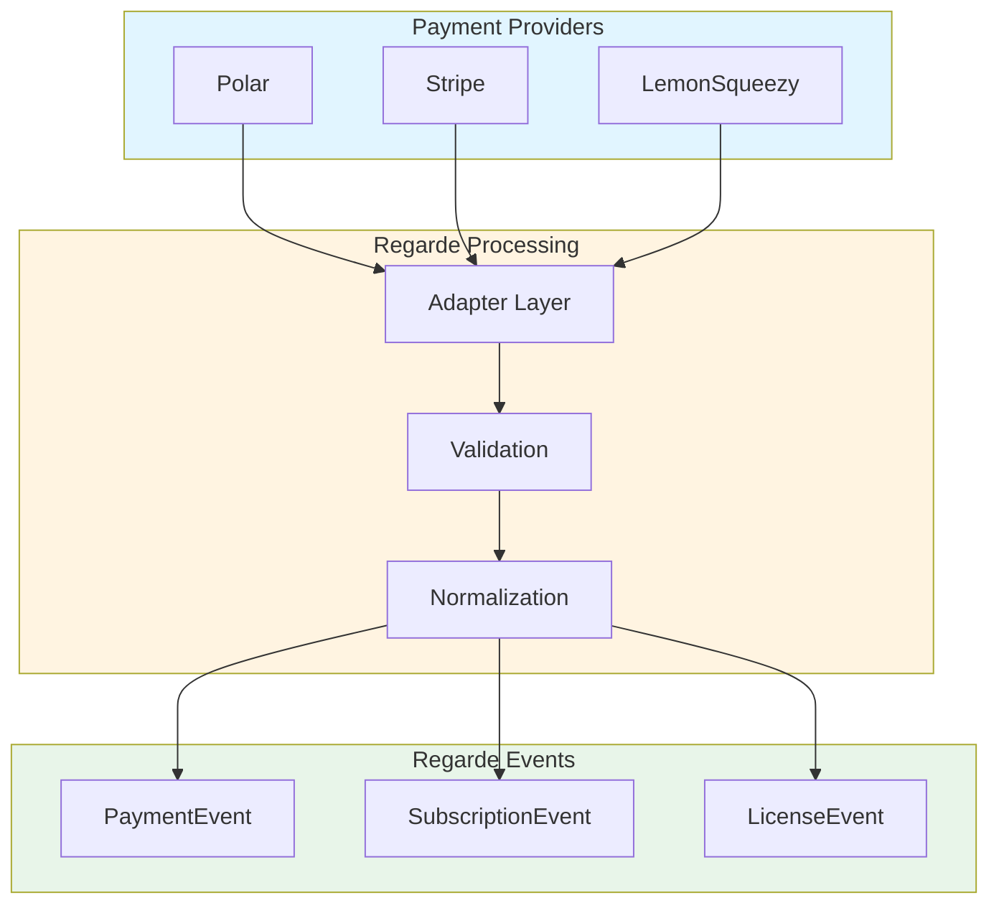
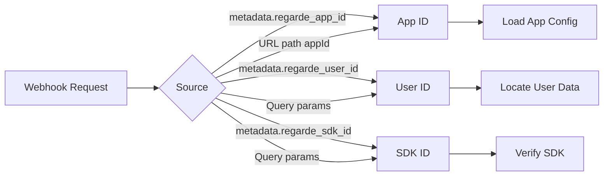
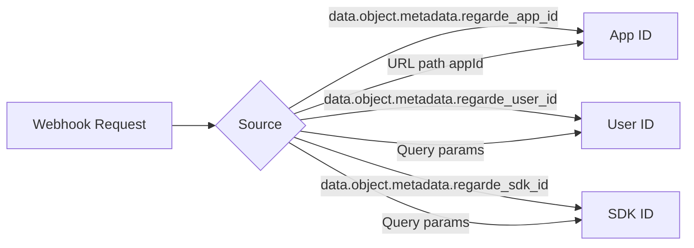
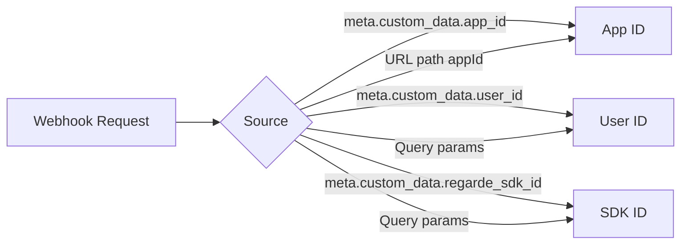
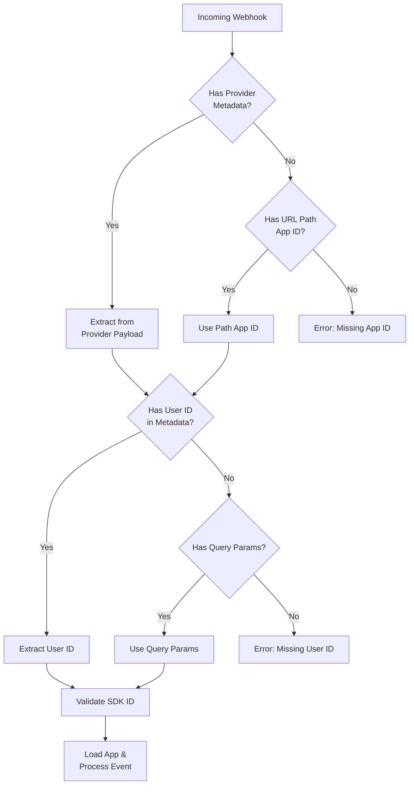
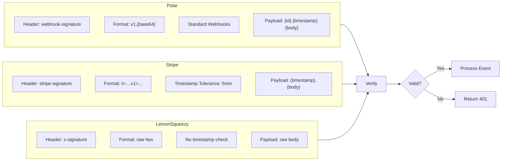
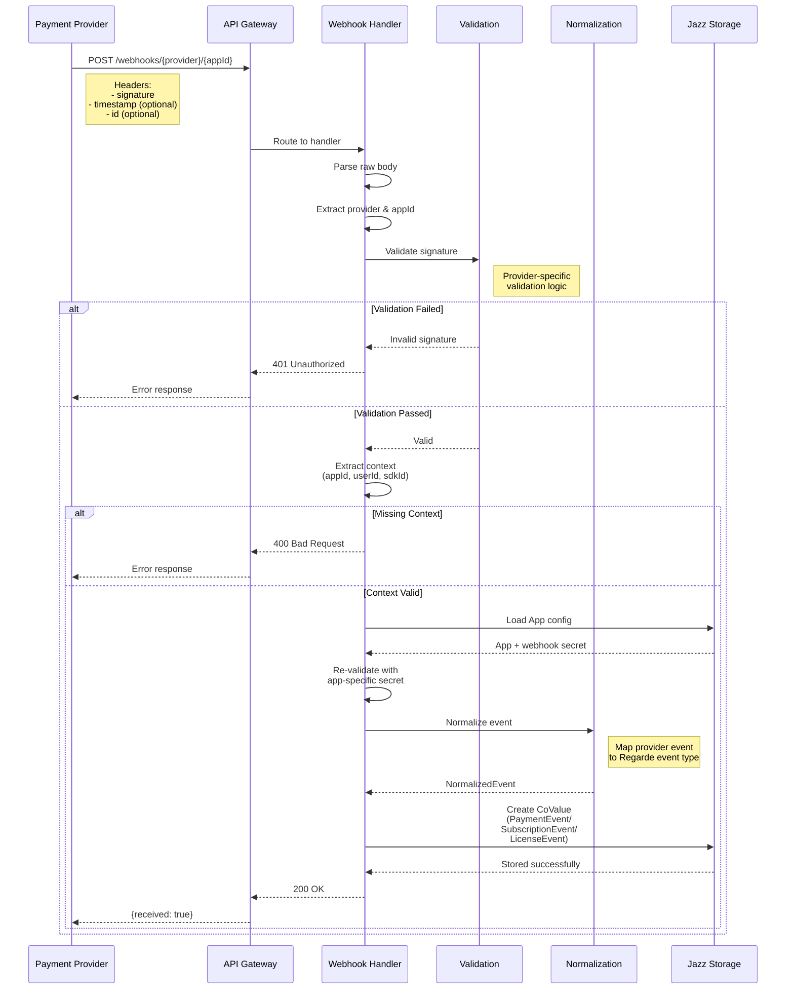

# Payment Provider Webhook Event Mapping

Complete reference for how payment provider webhook events map to Regarde event types.

## Overview

Regarde processes webhooks from three payment providers: **Polar**, **Stripe**, and **LemonSqueezy**. Each provider sends different event types that are normalized into three Regarde event categories:

- **PaymentEvent** — One-time purchases, refunds, failed payments
- **SubscriptionEvent** — Subscription lifecycle (created, updated, canceled)
- **LicenseEvent** — License grants and revocations



---

## Polar

### Event Mapping

| Provider Event            | Regarde Event         | Status                   | Notes                                   |
| :------------------------ | :-------------------- | :----------------------- | :-------------------------------------- |
| `order.paid`              | **PaymentEvent**      | `succeeded`              | Confirmed purchase                      |
| `order.created`           | **PaymentEvent**      | `pending` or `succeeded` | Checks order status field               |
| `refund.created`          | **PaymentEvent**      | `refunded`               | Full or partial refund                  |
| `subscription.created`    | **SubscriptionEvent** | mapped                   | Maps via `mapPolarSubscriptionStatus()` |
| `subscription.updated`    | **SubscriptionEvent** | mapped                   | Includes `cancelAtPeriodEnd` flag       |
| `subscription.active`     | **SubscriptionEvent** | `active`                 | Subscription activated                  |
| `subscription.canceled`   | **SubscriptionEvent** | `canceled`               | User-initiated cancel                   |
| `subscription.uncanceled` | **SubscriptionEvent** | mapped                   | Cancellation reversed                   |
| `subscription.revoked`    | **SubscriptionEvent** | `canceled`               | Provider-initiated termination          |
| `subscription.past_due`   | **SubscriptionEvent** | `past_due`               | Payment overdue                         |
| `benefit_grant.created`   | **LicenseEvent**      | `active`                 | New license issued                      |
| `benefit_grant.updated`   | **LicenseEvent**      | `active`/`revoked`       | Checks `is_revoked` flag                |
| `benefit_grant.revoked`   | **LicenseEvent**      | `revoked`                | License access removed                  |
| `benefit_grant.cycled`    | **LicenseEvent**      | `active`                 | License period renewed                  |

### Context Extraction

Polar extracts context from `data.metadata` with fallbacks:



**Priority Order:**

1. `data.metadata.regarde_app_id` (or `app_id`)
2. `data.metadata.regarde_user_id` (or `user_id`)
3. `data.metadata.regarde_sdk_id`
4. URL path `/{provider}/{appId}`
5. Query params `?regarde_user_id=&regarde_sdk_id=`

### Signature Validation

- **Header:** `webhook-signature`
- **Additional Headers:** `webhook-timestamp`, `webhook-id`
- **Format:** `v1,{base64-signature}`
- **Algorithm:** HMAC-SHA256
- **Payload:** `{id}.{timestamp}.{body}` (Standard Webhooks spec)

### Mode Detection

```typescript
const mode = data.is_sandbox === true ? "test" : "production";
```

---

## Stripe

### Event Mapping

| Provider Event                                    | Regarde Event         | Status             | Notes                                    |
| :------------------------------------------------ | :-------------------- | :----------------- | :--------------------------------------- |
| `checkout.session.completed`                      | **PaymentEvent**      | `succeeded`        | One-time checkout complete               |
| `invoice.paid`                                    | **PaymentEvent**      | `succeeded`        | Recurring payment received               |
| `invoice.payment_failed`                          | **PaymentEvent**      | `failed`           | Recurring payment failed                 |
| `customer.subscription.created`                   | **SubscriptionEvent** | mapped             | Maps via `mapStripeSubscriptionStatus()` |
| `customer.subscription.updated`                   | **SubscriptionEvent** | mapped             | Includes `cancelAtPeriodEnd` flag        |
| `customer.subscription.deleted`                   | **SubscriptionEvent** | `canceled`         | Subscription ended                       |
| `entitlements.active_entitlement_summary.updated` | **LicenseEvent**      | `active`/`revoked` | Based on entitlements data               |

### Context Extraction

Stripe extracts context from `data.object.metadata`:



**Priority Order:**

1. `data.object.metadata.regarde_app_id` (or `app_id`)
2. `data.object.metadata.regarde_user_id` (or `user_id`)
3. `data.object.metadata.regarde_sdk_id`
4. URL path `/{provider}/{appId}`
5. Query params `?regarde_user_id=&regarde_sdk_id=`

### Signature Validation

- **Header:** `stripe-signature`
- **Format:** `t={timestamp},v1={hex-signature}`
- **Algorithm:** HMAC-SHA256
- **Tolerance:** 5 minutes (300 seconds)
- **Payload:** `{timestamp}.{body}`

### Mode Detection

```typescript
const mode = event.livemode === false ? "test" : "production";
```

---

## LemonSqueezy

### Event Mapping

| Provider Event                  | Regarde Event         | Status          | Notes                                                     |
| :------------------------------ | :-------------------- | :-------------- | :-------------------------------------------------------- |
| `order_created`                 | **PaymentEvent**      | `succeeded`     | New order placed                                          |
| `order_updated` (failed)        | **PaymentEvent**      | `failed`        | Payment failed                                            |
| `order_updated` (refunded)      | **PaymentEvent**      | `refunded`      | Order refunded                                            |
| `subscription_created`          | **SubscriptionEvent** | mapped          | Status mapping: active/canceled/expired/past_due/trialing |
| `subscription_cancelled`        | **SubscriptionEvent** | `canceled`      | Subscription canceled                                     |
| `subscription_updated`          | **SubscriptionEvent** | mapped          | Any subscription change                                   |
| `subscription_payment_success`  | **PaymentEvent**      | `succeeded`     | Recurring payment successful                              |
| `subscription_payment_failed`   | **PaymentEvent**      | `failed`        | Recurring payment failed                                  |
| `subscription_payment_refunded` | **PaymentEvent**      | `refunded`      | Subscription payment refunded                             |
| `license_key_created`           | **LicenseEvent**      | `active`        | New license key generated                                 |
| `license_key_updated`           | **LicenseEvent**      | active/inactive | Based on `status` field                                   |

### Context Extraction

LemonSqueezy extracts context from `meta.custom_data`:



**Priority Order:**

1. `meta.custom_data.app_id`
2. `meta.custom_data.user_id`
3. `meta.custom_data.regarde_sdk_id`
4. URL path `/{provider}/{appId}`
5. Query params `?regarde_user_id=&regarde_sdk_id=`

### Signature Validation

- **Header:** `x-signature`
- **Format:** Raw hex string
- **Algorithm:** HMAC-SHA256
- **Payload:** Raw request body

### Mode Detection

```typescript
const mode = meta.test_mode === true ? "test" : "production";
```

---

## Webhook URL Structure

### Base URL Format

```
POST /webhooks/{provider}/{appId}?regarde_user_id={userId}&regarde_sdk_id={sdkId}
```

### Parameters

#### Path Parameters (Required)

| Parameter  | Values                            | Description                     |
| :--------- | :-------------------------------- | :------------------------------ |
| `provider` | `lemonsqueezy`, `stripe`, `polar` | Payment provider identifier     |
| `appId`    | String                            | App's Jazz Account ID (co\_...) |

#### Query Parameters (Optional - Testing Fallback)

| Parameter         | Description                                     |
| :---------------- | :---------------------------------------------- |
| `regarde_user_id` | Jazz Account ID of the user receiving the event |
| `regarde_sdk_id`  | Regarde SDK CoMap ID for verification           |

### Context Extraction Priority

All providers follow the same priority order for extracting context:



### Full Examples

#### Production (Metadata Embedded)

```bash
curl -X POST https://api.regarde.dev/webhooks/polar/co_app123 \
  -H "webhook-signature: v1,abc123..." \
  -H "webhook-timestamp: 1234567890" \
  -H "webhook-id: evt_123" \
  -H "Content-Type: application/json" \
  -d '{
    "type": "order.paid",
    "data": {
      "id": "order_123",
      "amount": 5000,
      "currency": "usd",
      "customer_id": "cus_123",
      "metadata": {
        "regarde_app_id": "co_app123",
        "regarde_user_id": "co_zUser456",
        "regarde_sdk_id": "co_sdk789"
      }
    }
  }'
```

#### Testing (Query Parameters Fallback)

```bash
curl -X POST "https://api.regarde.dev/webhooks/polar/co_app123?regarde_user_id=co_zUser456&regarde_sdk_id=co_sdk789" \
  -H "webhook-signature: v1,abc123..." \
  -H "webhook-timestamp: 1234567890" \
  -d '{
    "type": "order.paid",
    "data": {
      "id": "order_123",
      "amount": 5000,
      "currency": "usd"
    }
  }'
```

---

## Signature Validation Comparison



| Provider         | Header              | Format                | Algorithm   | Payload Structure         |
| :--------------- | :------------------ | :-------------------- | :---------- | :------------------------ |
| **Polar**        | `webhook-signature` | `v1,{base64-sig}`     | HMAC-SHA256 | `{id}.{timestamp}.{body}` |
| **Stripe**       | `stripe-signature`  | `t={ts},v1={hex-sig}` | HMAC-SHA256 | `{timestamp}.{body}`      |
| **LemonSqueezy** | `x-signature`       | `{hex-sig}`           | HMAC-SHA256 | `{raw-body}`              |

---

## Event Processing Flow



---

## Implementation Notes

### Critical Rules

1. **Always Use App-Specific Secret**: After loading the App CoMap, re-validate the signature using the app's stored `webhookSecret` (not a global secret).

2. **Explicit Boolean Checks**: Follow AGENTS.md Golden Rule:

   ```typescript
   // Prefer explicit comparisons
   const isValid =
     app.webhookSecret !== null &&
     app.webhookSecret !== undefined &&
     app.webhookSecret !== "";
   if (isValid === false) {
     throw new Error("Missing secret");
   }
   ```

3. **Sync Safety**: After creating a CoValue, always call `coMap.$jazz.waitForSync()` before using it.

4. **Deduplication**: Check `ProcessedProviderEvents` registry to avoid processing the same `prefixedProviderEventUUID` twice.

### Error Handling

| Error                      | Status Code | Cause                                            |
| :------------------------- | :---------- | :----------------------------------------------- |
| `Unsupported provider`     | 400         | Invalid `{provider}` path param                  |
| `Missing required context` | 400         | No metadata or query params found                |
| `Missing App ID`           | 400         | Path param empty or invalid                      |
| `App not found`            | 404         | AppId doesn't exist in Jazz                      |
| `Missing webhookSecret`    | 500         | App loaded but has no secret configured          |
| `Invalid signature`        | 401         | Signature validation failed                      |
| `Duplicate event`          | 200         | Event already processed (safe to return success) |
| `Unsupported event type`   | 500         | Provider sent unmapped event type                |

---

## Related Files

- `packages/api.regarde.dev/src/domains/payments/adapters/polar.ts` — Polar adapter implementation
- `packages/api.regarde.dev/src/domains/payments/adapters/stripe.ts` — Stripe adapter implementation
- `packages/api.regarde.dev/src/domains/payments/adapters/lemonsqueezy.ts` — LemonSqueezy adapter implementation
- `packages/api.regarde.dev/src/domains/payments/adapters/types.ts` — Shared adapter interfaces
- `packages/api.regarde.dev/src/domains/payments/handlers/unifiedWebhook.ts` — Webhook processing logic
- `packages/api.regarde.dev/src/routes/unifiedWebhook.ts` — Route definition
